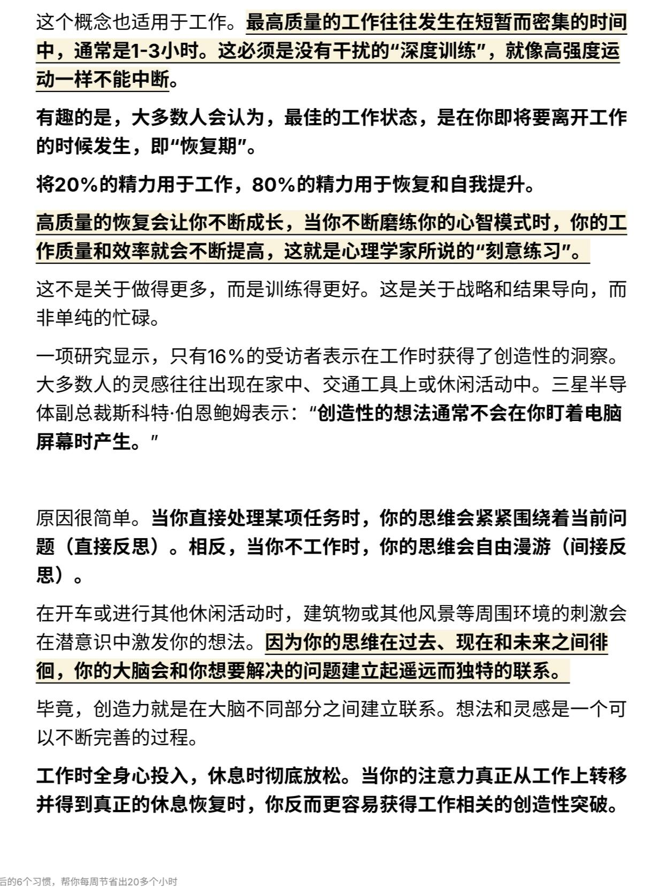

[toc]

# 正文

🙋 哈佛心理学博士认为，首先要明确你的优先事项，在此基础上，坚持培养6个晨间习惯，将会大幅提高个人生产力和生产效率，帮你每周节省出20多小时的宝贵时间～
	
👉 部分高亮观点总结：
1️⃣ 通常情况下，我们有大约3个小时的黄金时段，在这期间我们的注意力高度集中，能够在规划、思维、口语表达等方面做出卓越的贡献。
	
2️⃣ 早晨是大脑最敏锐的时候，也是身体能量水平最高的时候。所以，一天中的头3个小时是完成最重要工作的最佳时机。
	
3️⃣ 真正的心理脱离，意味着在非工作时间完全避免与工作相关的活动和思考。
	
4️⃣工作时全身心投入，休息时彻底放松。当你的注意力真正从工作上转移并得到真正的休息恢复时，你反而更容易获得工作相关的创造性突破。
	
5️⃣ 大脑是身体的一部分。身体更健康，大脑自然也会运作得更好。
	
6️⃣ 与其管理你的时间，不如把重点放在精力管理上。
	
7️⃣当你反复听一首歌时，你会沉浸其中，这能阻止你的思想走神。
	
💡 以上内容对你有帮助吗？分享一下你的想法吧～
	
                   

作者: [知识旷野｜深度阅读](https://www.xiaohongshu.com/user/profile/5fae74ff000000000100a875)

发布时间：2025-4-16 21:35:13

发布位置：北京

收集时间：2025-5-8 21:17:47

原文地址：[坚持早起后6个习惯，帮你每周节省20多个小时](https://www.xiaohongshu.com/explore/67ffb211000000001b03c30c?xsec_token=CBHX8H0OcjBC56Gwb2M90OIGxPSWgmiat7sFhf38hwDfM=&xsec_source=pc_feed) 

