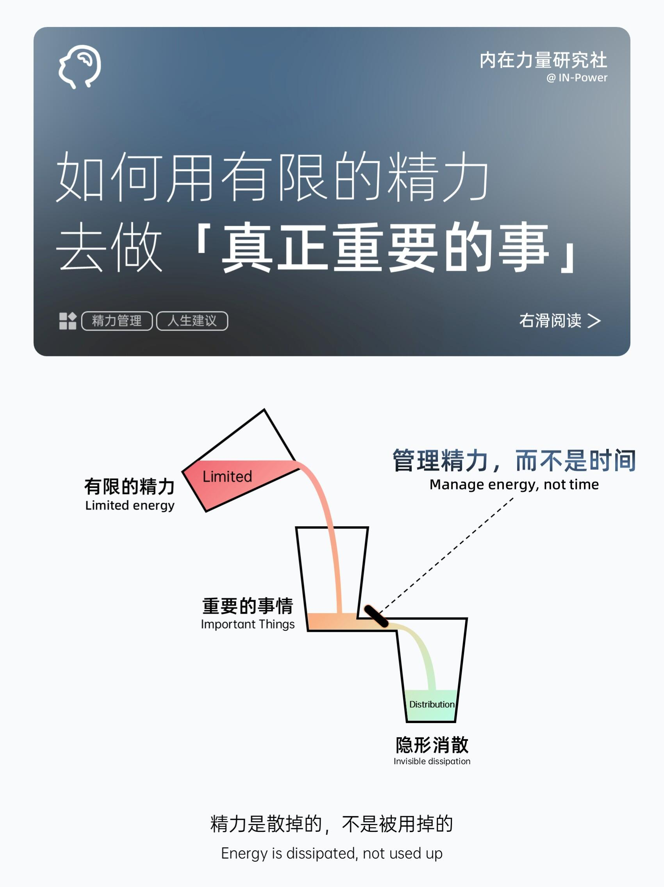
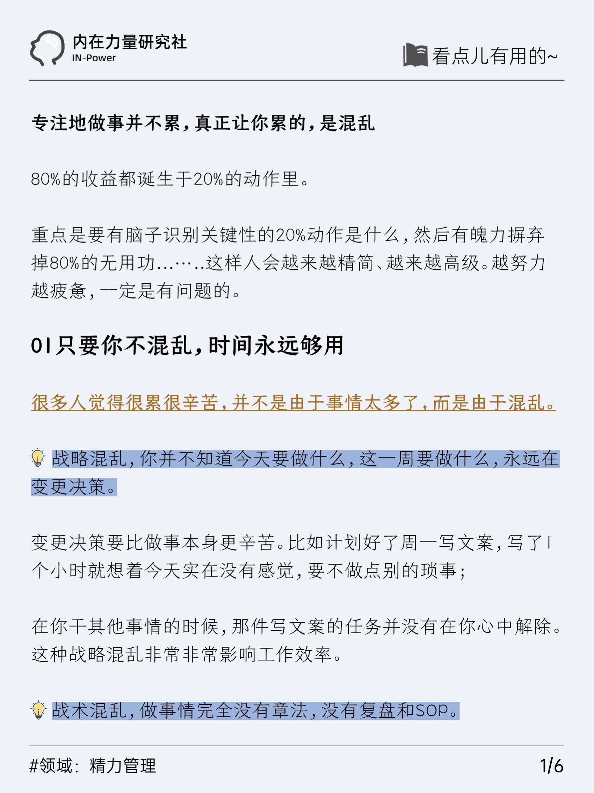
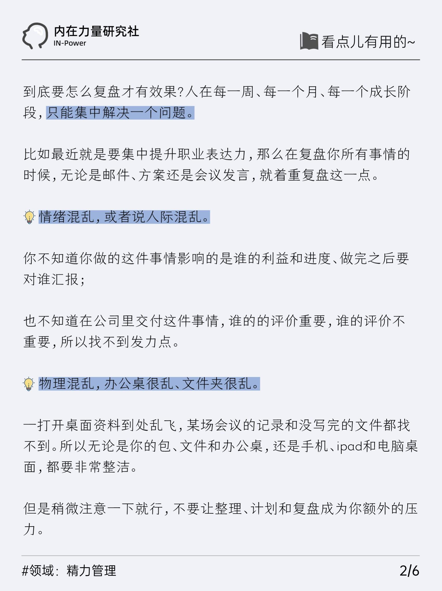
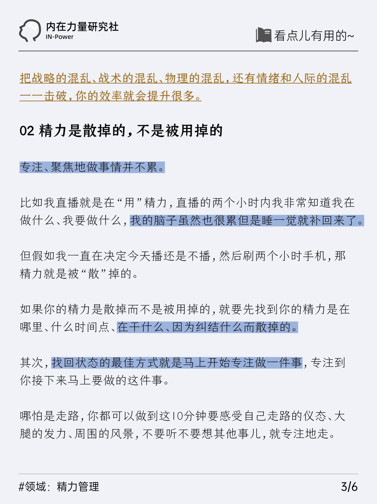
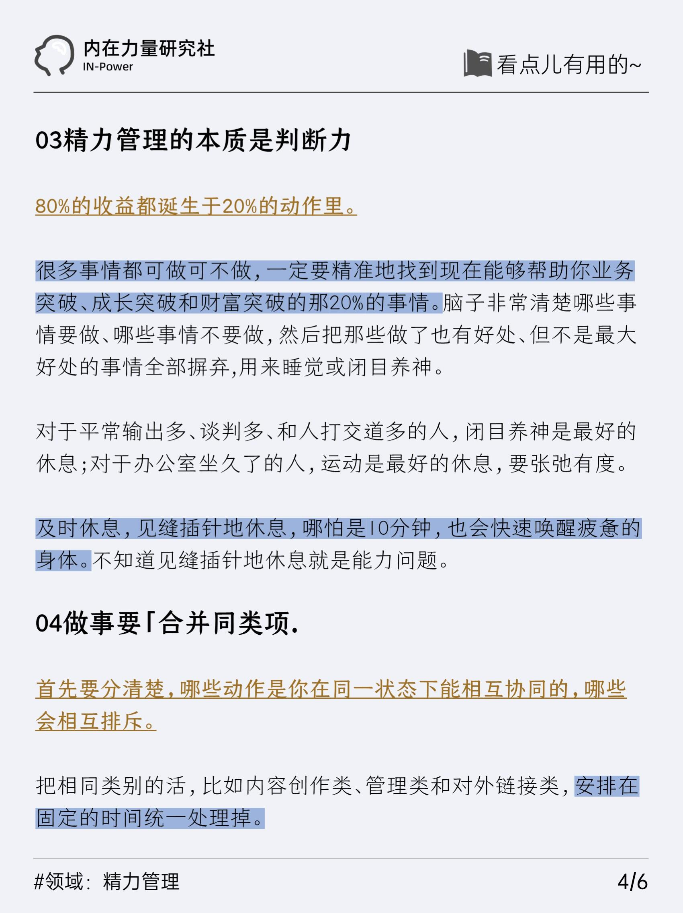
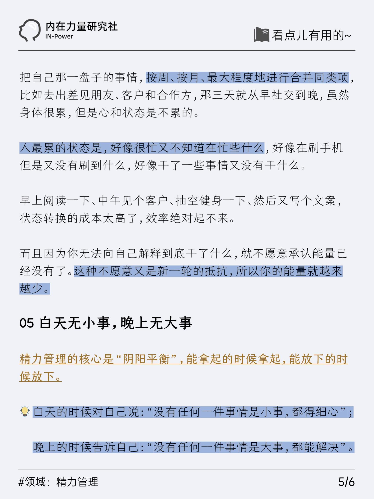
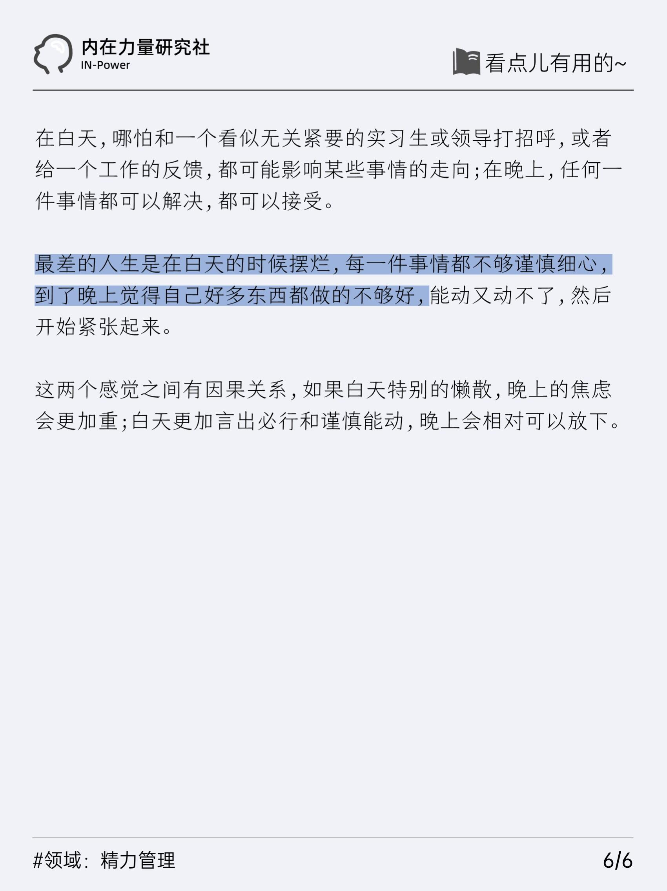
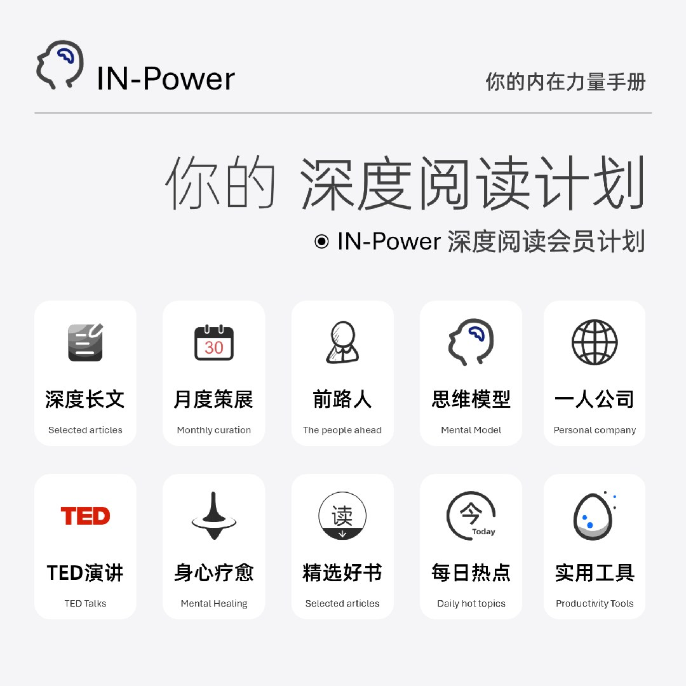

[toc]

# 正文

专注地做事并不累，真正让你累的，是混乱
	
80%的收益都诞生于20%的动作里。
	
重点是要有脑子识别关键性的20%动作是什么，然后有魄力摒弃掉80%的无用功...…..这样人会越来越精简、越来越高级。越努力越疲惫，一定是有问题的。
  

作者: [『内在力量』研究社](https://www.xiaohongshu.com/user/profile/67868d70000000000601efef)

发布时间：2025-5-5 20:45:56

发布位置：安徽

收集时间：2025-5-7 9:25:55

原文地址：[如何用有限的精力 去做「真正重要的事」](https://www.xiaohongshu.com/explore/6818b3030000000023017bf8?xsec_token=CB7a1gvV107JCtsVLk5cw6CWelAq6m8obR9zFcZNTYg2E=&xsec_source=pc_feed) 

# 评论

1. **『内在力量』研究社** (<small title="浙江">2025-5-6 17:38:56</small>): ❑ IN-Power | 深度阅读会员计划
服务一：全年48期深度长文（epub/pdf格式）
服务二：全年12期专题月刊（epub/pdf格式）
服务三：知识库全年权限（100+专题持续更新）
服务四：思维模型｜前路人｜TED｜一人公司
服务五：读者共建群内容共享、深度讨论和陪伴  
   - **『内在力量』研究社** (<small title="浙江">2025-5-6 18:2:49</small>): 🔵更多文章点击这里［向右R］深度阅读社区会员  
2. <a href="https://www.xiaohongshu.com/user/profile/5c5926f9000000001a016bbc">BIBIBIBI</a> (<small title="广东">2025-5-6 21:41:25</small>): 最烦的是本来已经很忙了 领导总突然给你加伙儿  
   - **『内在力量』研究社** (<small title="浙江">2025-5-6 22:27:45</small>): 领导才不管  
   - <a href="https://www.xiaohongshu.com/user/profile/5c5926f9000000001a016bbc">BIBIBIBI</a> (<small title="回复于 2025-5-6 23:23:36/广东"> ✉️:『内在力量』研究社</small>): 真的  
3. <a href="https://www.xiaohongshu.com/user/profile/658e230a000000001f012dea">木木</a> (<small title="上海">2025-5-6 18:57:14</small>): 学到了  
   - **『内在力量』研究社** (<small title="浙江">2025-5-6 22:28:0</small>): 感谢喜欢［种草R］  
4. <a href="https://www.xiaohongshu.com/user/profile/56178ad5a75c9546554cb541">钟进士文创</a> (<small title="浙江">2025-5-6 16:7:9</small>): 学会取舍，专注重要的事儿！🌟  
   - **『内在力量』研究社** (<small title="浙江">2025-5-6 17:26:43</small>): 没错儿［棒R］  
5. <a href="https://www.xiaohongshu.com/user/profile/582599906a6a69478b17d7e5">🎀xxxz</a> (<small title="浙江">2025-5-6 19:13:7</small>): 谢谢 很受用  
   - **『内在力量』研究社** (<small title="浙江">2025-5-6 22:27:54</small>): 感谢喜欢［种草R］  
6. <a href="https://www.xiaohongshu.com/user/profile/636d09ca000000001f015ece">贺友HEU</a> (<small title="上海">2025-5-7 3:26:21</small>): 真正让你累的，是混乱
 说的太对了  
7. <a href="https://www.xiaohongshu.com/user/profile/5e4f7fbc000000000100613b">Albert PPT</a> (<small title="安徽">2025-5-5 21:37:39</small>): 有一个很经典的“堵车效应”理论，就是无论你的车技再好，一旦处在漫漫车流中你也无法回避堵车。现实社会中，影响你的人为因素或环境因素太多，也就是所谓的猪队友、幺蛾子是摆脱不了的，没有所谓的最优解。通俗的讲对于普通人来说，白天是牛马，晚上是会做梦的牛马，一切都是幻想［呃R］  
   - <a href="https://www.xiaohongshu.com/user/profile/5d864a2a00000000010036b0">喜多夕</a> (<small title="四川">2025-5-5 21:51:38</small>): 那就尽量择优的环境呆  
8. <a href="https://www.xiaohongshu.com/user/profile/5ed0fa120000000001002753">弄臣|</a> (<small title="内蒙古">2025-5-6 10:16:19</small>): 总结描述的真好  
   - **『内在力量』研究社** (<small title="浙江">2025-5-6 10:18:28</small>): 谢谢您夸奖［派对R］  
9. **『内在力量』研究社** (<small title="安徽">2025-5-5 20:58:1</small>): 本内容由@内在力量研究社 策展分享［棒R］  
10. <a href="https://www.xiaohongshu.com/user/profile/5b405f454eacab2760c979ec">Nah</a> (<small title="广东">2025-5-6 14:6:7</small>): @33 @LyXuan  

=[评论](./attachments/comments.json)

